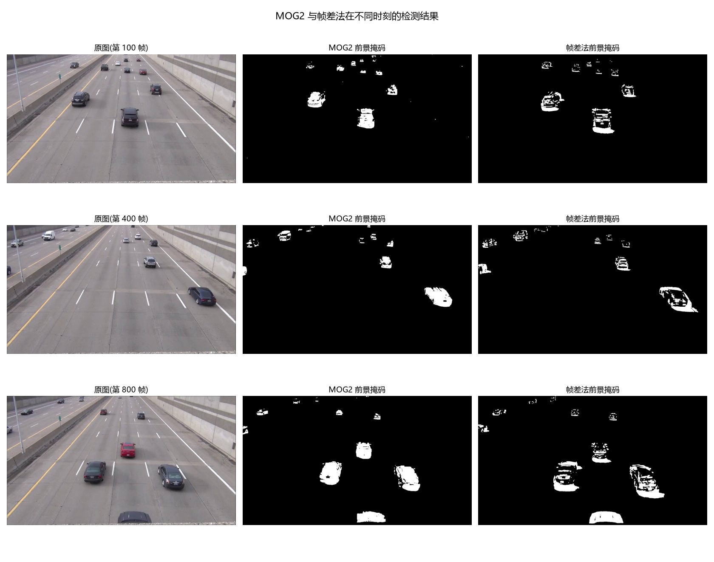
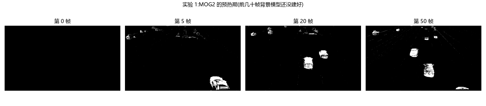

# task-2 报告草稿(一、二、三节)

> 用法:把下面三段整块复制进 `report\报告模板.md`,替换掉原来的一/二/三节。
> 里面的数字都是实测值,图片路径已经按 `../results/xxx.png` 写好,不用改。

---

## task-2 OpenCV 与 Pillow 的使用

### 一、图像读写与通道分离


用 OpenCV 读入图片,再用 Pillow 读同一张图,并用数字验证两者的差别:

1. 图像在内存里是 **(高, 宽, 3)** 的 **uint8** 数组,三个通道的取值范围各是 0 到 255。
2. **OpenCV 按 BGR 读,Pillow 和 matplotlib 按 RGB 读**,跨库使用必须先转换,否则红蓝会互换。
   实测同一块纯红区域:OpenCV 的第 0 个通道(B)均值是 0.0,Pillow 的第 0 个通道(R)均值是 255.0。
   用 `np.array_equal(img_bgr[:, :, ::-1], np.asarray(img))` 验证结果为 `True`,
   说明两个库读到的**是同一批数据,只是通道顺序的约定不同**。
3. 分离通道得到的是单通道**灰度图**(形状只剩两个维度);灰度化是按人眼敏感度**加权**
   (`0.299R + 0.587G + 0.114B`),而不是把三个通道简单取平均。手工按公式复算,
   与 `cv2.cvtColor(..., COLOR_BGR2GRAY)` 的结果最大误差只有 0.5(四舍五入造成)。

### 二、几何变换

缩放:


平移:


旋转:


翻转:


拼图总览:


**仿射矩阵的用法与理解:**

平移和旋转都通过 **2×3 仿射矩阵 + `cv2.warpAffine`** 完成。矩阵形式为
`[[a, b, tx], [c, d, ty]]`,读法是两条公式:

```
新 x = a·x + b·y + tx
新 y = c·x + d·y + ty
```

- **对角线 `(0,0)` `(1,1)`** 管缩放
- **非对角线 `(0,1)` `(1,0)`** 管旋转和剪切(让两个方向互相影响)
- **第三列** 管平移
- 想要"纯"缩放,非对角线必须是 0

之所以是 2×3 而不是 2×2:2×2 矩阵做不了平移(乘法永远把原点映射到原点),
加一列平移量才能统一表示"线性变换 + 平移",这就是仿射变换。

**画布尺寸的坑(本题重点):** `warpAffine` 的第三个参数是输出画布大小,而输出画布原点
固定在左上角,不会自动居中。若旋转后仍沿用原画布,四个角会被裁掉(见上面"被裁"那张);
正确做法是先按旋转角计算外接矩形尺寸 `new_w = w·cosθ + h·sinθ`、`new_h = w·sinθ + h·cosθ`,
再把旋转轴平移到新画布中心,即给矩阵第三列补上 `new_w/2 - w/2` 与 `new_h/2 - h/2`。
实测:图像中心经修正后的矩阵变换,正好落在新画布中心 `(594.5, 511.5)`。

**翻转**用 `cv2.flip(img, 1/0/-1)` 一行完成(`1` 水平、`0` 垂直、`-1` 两个方向都翻)。
实测 `flip(-1)` 与 `cv2.rotate(img, ROTATE_180)` 的结果完全相同(`np.array_equal` 为 `True`)。
若只需转 90° 的整数倍,用 `cv2.rotate` 更直接,且不会产生黑边(注意 90° 会使宽高互换)。

**插值方式的选择:** 缩小用 `INTER_AREA`(区域平均),放大用 `INTER_LINEAR` 或 `INTER_CUBIC`。
实验对比:把图缩到 1/8 再放大回原尺寸,`INTER_NEAREST` 出现明显方块马赛克,
而 `INTER_LINEAR` 和 `INTER_CUBIC` 都较平滑。

### 三、轮廓检测与面积周长


**处理流程:** 灰度化 → 高斯模糊(5×5)去噪 → Canny 边缘检测(50/150) →
形态学闭运算(5×5 核,迭代 3 次)连接断口 → `findContours` 提取轮廓 → 计算面积与周长。

**为什么不用简单阈值:** 该图灰度分布集中在中间区间(实测约 89.6% 的像素落在 100~200 之间),
天空与机身的灰度过于接近,直接用 `threshold` 会把两者切到一起 ——
实验对比中,阈值 150 二值化后最大连通区域达到 254400 平方像素,远大于飞机本身,
说明分割失败。因此选择"Canny 边缘 + 闭运算"的路线。

**闭运算是本题的关键:** Canny 的边缘存在断口(机身与天空对比度低),
若不做闭运算,一架飞机会被拆成许多碎轮廓 —— 实测不做闭运算得到 78 个轮廓、
最大轮廓仅 414 平方像素,完全抓不到飞机;做完闭运算后得到 **1 个完整轮廓**,
面积 72824 平方像素,与飞机实际范围吻合。边缘像素数从 6376 增加到 22493,断口即由此连接。

**轮廓数据(均用 `RETR_EXTERNAL` 统计):**

| 指标 | 数值 |
|---|---|
| 轮廓总数量 | 1 |
| 所有轮廓总面积 | 72824 平方像素(占全图 12.0%) |
| 所有轮廓总周长 | 2293 像素 |
| 最大轮廓面积 / 周长 | 72824 平方像素 / 2293 像素 |
| 外接矩形 | 左上角 (104, 190),宽 820、高 186 |
| 填充率(轮廓面积 ÷ 外接矩形面积) | 47.7% |

**参数说明:** 高斯模糊核 5×5;Canny 双阈值 50 / 150;闭运算核为 5×5 的 `np.ones`,
迭代 3 次;轮廓检索模式 `RETR_EXTERNAL`(只取最外层,避免把机身孔洞重复计入面积),
近似方式 `CHAIN_APPROX_SIMPLE`;面积过滤阈值 500 平方像素(过滤前后数量由 21 降到 17,
面积仅损失 1.2%)。

**关于"总面积"的一个细节:** 若把检索模式换成 `RETR_LIST`,会额外检出机身上的孔洞轮廓,
此时把所有轮廓面积相加会得到 127535 平方像素 —— 比飞机实际面积大得多,
因为这些孔洞被当作正面积重复累加了。**所以统计总面积必须用 `RETR_EXTERNAL`。**

**结论:** 轮廓检测的效果取决于"二值图的质量"而不是 `findContours` 本身。
本例中,边缘的连接性(闭运算)与检索模式的选择,直接决定了能否得到一条完整、可用于测量的飞机轮廓。

### 四、运动目标检测:MOG2 背景减除与帧差法对比





**测试视频:** `example2.mp4`,分辨率 1280×720,30 fps,共 984 帧(32.8 秒),
内容为高速公路车流,画面中同时存在多辆行驶中的车辆,适合作为运动目标检测的测试场景。

**两种方法的原理:**

- **MOG2 背景减除**:为每个像素维护一个历史模型,新帧与模型差异较大的像素判为前景。
  它比较的是"当前画面与**背景**的差异"。
- **帧差法(不使用背景减除)**:仅比较相邻两帧的差异(`cv2.absdiff` + 阈值化)。
  它比较的是"当前画面与**上一帧**的差异"。

**两种方法的对比数据(已跳过前 30 帧的预热期):**

| 指标 | MOG2 背景减除 | 帧差法 |
|---|---|---|
| 处理速度 | 61.6 fps | **130.9 fps(约 2.1 倍)** |
| 平均前景像素数 | 20448 | 18482 |
| 前景像素标准差 | 14936 | 13099 |
| 检测到目标的帧比例 | **100.0%** | 97.3% |
| 平均目标框个数 | **5.80 个** | 6.84 个 |
| 平均目标框总面积 | **29168 平方像素** | 31705 平方像素 |

**观察到的现象与分析:**

1. **帧差法更快**:不需要维护背景模型,每帧只做一次绝对差,实测速度约为 MOG2 的 2.1 倍。
2. **MOG2 的检出更完整**:帧差法在 2.7% 的帧上未检出任何目标(相邻两帧变化不足),
   而 MOG2 在所有帧上都检出了目标。
3. **帧差法的目标框更多、更大**:帧差法平均 6.84 个框,比 MOG2 多出约 1 个;
   框的总面积也更大。原因是帧差法检测的是"两帧之间**发生过变化**的区域"——
   快速行驶的车辆在第 N 帧与第 N+1 帧的位置不同,前后位置之间的整条区域都会被标为前景,
   形状被拉长(拖影),有时还会被切成两块、被计成两个目标。MOG2 检测的是"与背景不同的区域",
   因此目标形状更贴近物体本身。
4. **MOG2 存在预热期**:实测前 4 帧无任何输出,第 5 帧起才出现前景,
   前 60 帧的检测结果波动较大(13000~62000 像素),说明背景模型需要一定时间才能建立稳定。
   因此工程上通常要丢弃开头的若干帧,或先让算法"看"一段没有目标的视频。

**参数影响实验:**

- **阴影处理**:`detectShadows=True` 时,阴影像素的值为 127。若不清除,
  实测前景像素从 6183 增加到 15908,目标框从 4 个增加到 7 个 —— 阴影与目标连成一片,
  导致框变大甚至把多个目标粘连。
- **`varThreshold`(判定阈值)**:取 4 / 16 / 64 时,前景像素数分别为
  24295 / 20104 / 13485。阈值越小越敏感,但会把噪声和光照抖动也当作前景;
  阈值过大则会漏掉真实目标。

**两种方法的优缺点总结:**

| 方法 | 优点 | 缺点 |
|---|---|---|
| MOG2 背景减除 | 检出完整,目标形状贴近物体;物体静止后仍能持续检出;对缓慢的光照变化有一定适应性 | 需要预热;计算量较大;参数(history、varThreshold)需要调 |
| 帧差法(无背景减除) | 实现简单、速度快;无需预热;不受长期光照变化影响 | 快速运动产生拖影、易把目标拆成多个框;运动过慢会漏检;物体静止后完全消失 |

**结论:** 两种方法的本质差别在于**比较对象**——MOG2 与**背景模型**比较,帧差法与**上一帧**比较。
因此在"物体始终在运动、且对速度要求高"的场景(如本例的车流)中,帧差法足够用且更快;
而在"目标可能短暂静止、需要稳定持续检测"的场景中,必须使用 MOG2 这类背景减除方法。
本实验也说明:**评估检测算法不能只看"能不能检到",还要看目标的个数与形状是否准确**。
