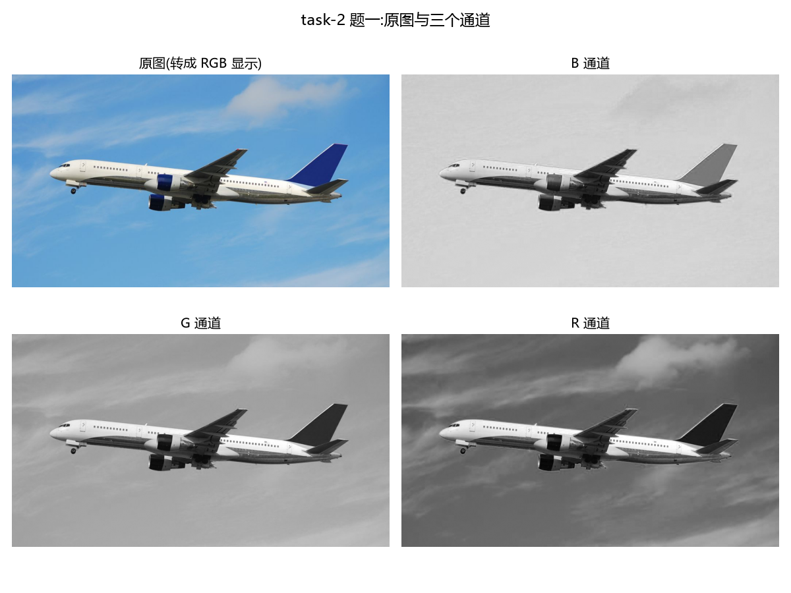
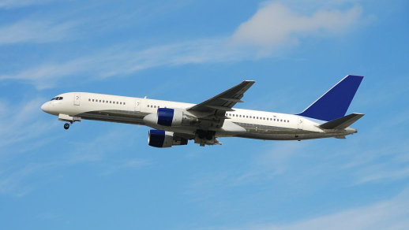
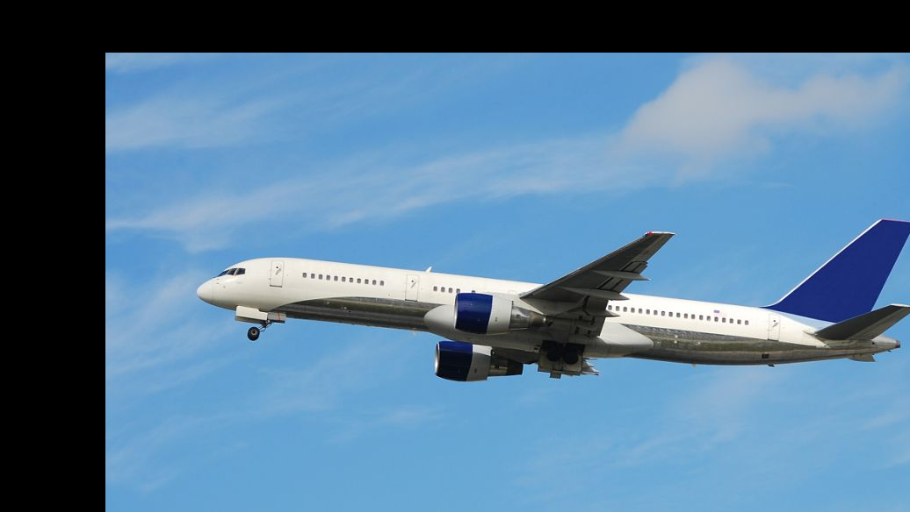
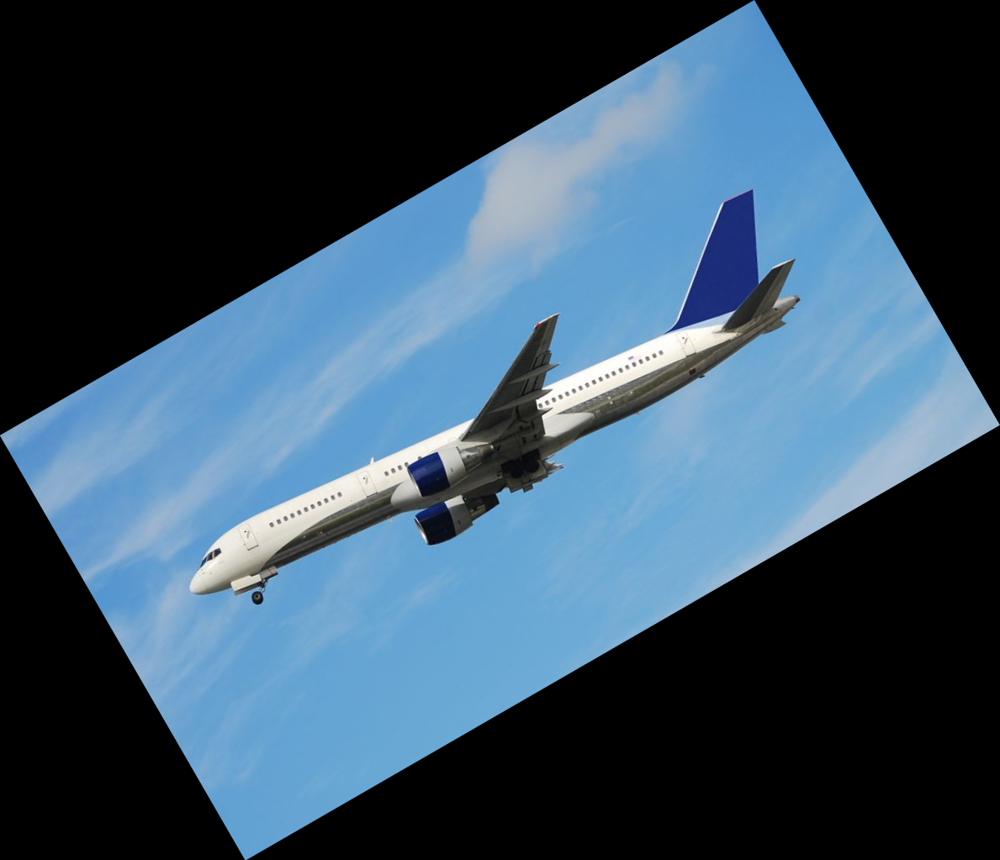
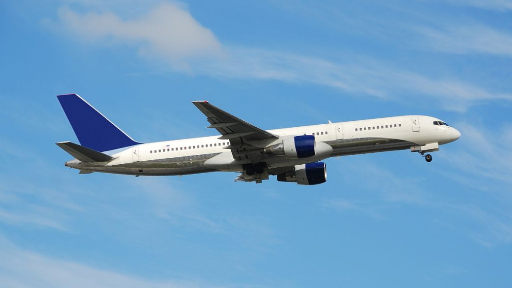
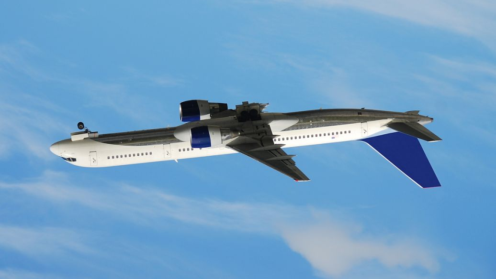
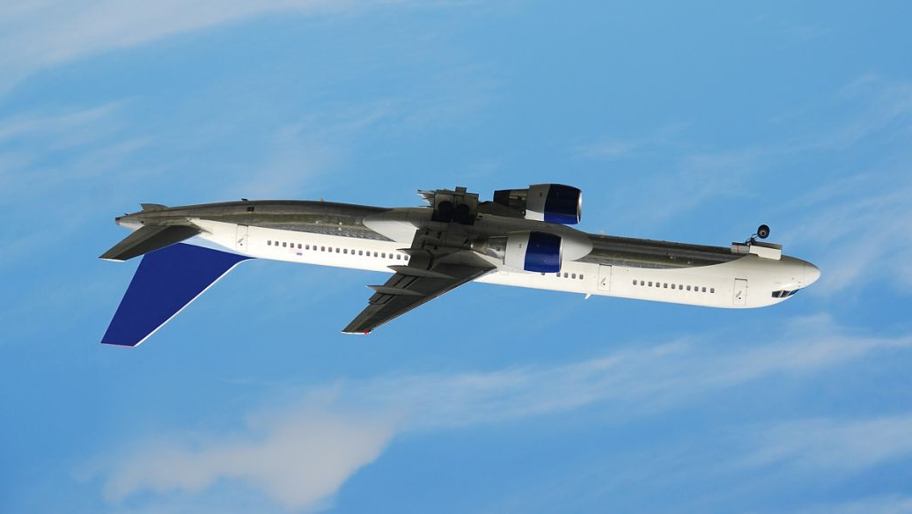

# 实验报告

> 用法:每做完一小题,就把结论和图填进来,别留到最后一天。

**姓名:** 　**班级:** ________　**学号:** ________

---

## task-2 OpenCV 与 Pillow 的使用

### 一、图像读写与通道分离

1.图像在内存里是（高，宽，3）的unint8数组，三个通道各是0-255
2.OpenCV按BGR读，Pillow/matplotlib按RGB，跨库使用必须先转换，否则红蓝转换
3.分离通道得到的是单通道灰度图；灰度化是按照人眼敏感度加权，而不是简单平均

(贴结果图 + 说明:OpenCV 读入是 BGR、Pillow/matplotlib 是 RGB,通道顺序不同会导致颜色异常)

### 二、几何变换

(贴缩放、旋转、平移、翻转的结果图;说明仿射矩阵的作用)
缩放：

平移：

旋转：

翻转：

仿射矩阵 以x=[a,b,c]为例，x_new=ax+by+c

### 三、轮廓检测与面积周长

(贴带轮廓的图像)

- 轮廓总数量:______
- 轮廓总面积:______
- 轮廓总周长:______
- 参数说明:阈值、是否做了形态学处理、面积过滤阈值

### 四、运动目标检测:MOG2 与帧差法对比

| 方法 | 优点 | 缺点 | 观察到的现象 |
|---|---|---|---|
| MOG2 背景减除 | | | |
| 帧差法(未用背景减除) | | | |

### 五、目标追踪

- 使用的追踪器:CSRT / KCF(实测对比)
- 追踪结果:(贴视频截图)
- 如何提高追踪准确度:
  1.
  2.
  3.

---

## task-3 MLP 识别 MNIST

### 一、深度学习概念理解

(概念表:概念 / 一句话解释 / 代码锚点)

### 二、梯度下降拟合二元函数

- 拟合形式:y = a1*x1^2 + a2*x1*x2 + a3*sin(x1) + a4*cos(2*x2) + exp(a5*x1) + a6*x2 + b

| 参数 | 真值 | 拟合值 |
|---|---|---|
| a1 | 2 | |
| a2 | 1.5 | |
| a3 | 3 | |
| a4 | 0.5 | |
| a5 | -0.5 | |
| a6 | 0.8 | |
| b | 2026 | |

- 决定系数 R²:______
- 说明:这是用梯度下降做非线性最小二乘;b 的尺度是 2000 量级,初始化需贴近真实值

(贴两张三维曲面图:不含噪声的真实函数 + 拟合函数)

### 三、MLP 识别手写数字

- 网络结构:784 → 256 → 128 → 10,ReLU + Dropout
- 训练配置:Adam(lr=1e-3)、batch 64、8 个 epoch
- 测试准确率:______

(贴 Loss / Train Acc / Test Acc 三条曲线 + 三张预测可视化)

---

## 方向 3 · 时序预测(LSTM)

- 数据集:Air Passengers,144 个月
- 预处理:MinMax 归一化;按时间顺序切分 8:2;滑动窗口长度 ______
- 模型结构:LSTM(hidden=64, layers=2) + Linear(64,1)

| 指标 | 数值 |
|---|---|
| MAE | |
| RMSE | |
| MAPE | |

(贴 Loss 曲线 + 预测值 vs 真实值对比图)

**提高部分:**(窗口长度对比 / LSTM vs GRU / 多变量输入,选 1-2 个写)

---

## 方向 2 · 图像分类(CNN)

- 数据集:______(类别数 ______,训练 / 测试图片数 ______)
- 数据增强:Resize(256) + RandomResizedCrop(224) + RandomHorizontalFlip + ImageNet 归一化
- 模型:预训练 resnet18 微调(先冻结 backbone 训 fc,再整体 lr=1e-4 微调)
- 测试准确率:______

(贴 Loss / Train Acc / Test Acc 曲线 + 混淆矩阵 + 分类结果可视化)

**模型结构设计说明:**

**结果分析:**

**提高部分:**(数据增强前后对比,或注意力模块 / 换骨干网络对比)

---

## 附:提交清单

- [ ] 代码已推到 GitHub public 仓库
- [ ] README 写清楚环境与运行方式
- [ ] 视频、图片、报告打包发到邮箱
- [ ] Issues 按 `班别-姓名-学号-仓库链接` 提交
